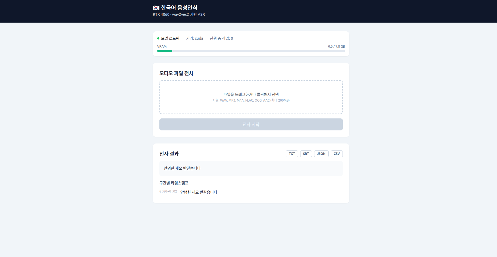

# 🇰🇷 Korean ASR for RTX 4060

RTX 4060 8GB에 최적화된 한국어 음성 인식(ASR) 시스템.
`kresnik/wav2vec2-large-xlsr-korean` 모델로 음성을 텍스트로 전사하며,
**웹 UI · REST API · CLI · 파이썬 라이브러리** 네 가지 방식으로 사용할 수 있다.



## 🌟 주요 특징

- **RTX 4060 8GB 최적화** — 제한된 VRAM을 고려한 FP16 추론·청킹·메모리 관리
- **한국어 특화** — `kresnik/wav2vec2-large-xlsr-korean` 모델 사용
- **웹 UI** — 브라우저에서 오디오 업로드 → 비동기 전사 + 진행률 표시
- **REST API** — FastAPI 기반, 모델 1회 로드 후 상주
- **CLI** — 단일/배치/녹음/벤치마크 명령
- **다양한 출력 형식** — JSON, TXT, SRT, CSV
- **자동 청킹** — 긴 오디오를 30초 단위로 분할 처리
- **메모리 모니터링** — 실시간 VRAM 사용량 추적

## 📁 프로젝트 구조

```
korean_asr_rtx4060/
├── README.md
├── demo.png
├── docs/                      # 아키텍처 · UML 문서
│   ├── architecture.md
│   └── uml.md
├── backend/                   # 파이썬 백엔드 (모든 파이썬 명령은 여기서 실행)
│   ├── config/config.yaml     # 설정 파일
│   ├── requirements.txt
│   ├── environment.yml        # conda 환경 정의
│   ├── src/
│   │   ├── core/              # asr_engine.py, memory_manager.py
│   │   ├── utils/             # audio_utils.py, file_utils.py
│   │   ├── apps/              # cli_app.py, batch_app.py, realtime_app.py
│   │   └── api/               # main.py, routes.py, jobs.py (FastAPI)
│   ├── examples/basic_usage.py
│   ├── tests/                 # pytest 단위 테스트
│   └── data/                  # sample_audio, outputs, temp
└── frontend/                  # React + Vite + TypeScript 웹 UI
    └── src/
        ├── api/client.ts
        ├── hooks/useJob.ts
        ├── components/        # Uploader, JobProgress, ResultView, SystemPanel
        └── App.tsx
```

> 📐 시스템 설계와 다이어그램은 [`docs/architecture.md`](docs/architecture.md)와
> [`docs/uml.md`](docs/uml.md)를 참고한다.

## 🚀 빠른 시작

### 1. 백엔드 설치

> 모든 파이썬 명령은 `backend/` 디렉토리에서 실행한다.

```bash
cd backend

# 가상환경 생성
python -m venv venv
source venv/bin/activate          # Linux/Mac
# venv\Scripts\activate           # Windows

# 의존성 설치
pip install -r requirements.txt

# CUDA 버전에 맞는 PyTorch 설치 (RTX 4060, Ada / sm_89)
pip install torch --index-url https://download.pytorch.org/whl/cu121
```

또는 conda 환경으로 한 번에 구성할 수 있다:

```bash
conda env create -f backend/environment.yml
conda activate korean_asr_rtx4060
```

### 2. 웹 서비스 실행 (권장)

**백엔드 (FastAPI)** — `backend/`에서:

```bash
# 모델/GPU를 공유하므로 워커는 반드시 1개 (기본값)
uvicorn src.api.main:app --host 0.0.0.0 --port 8000
```

- 시작 시 모델을 1회 로드해 상주시킨다.
- API 문서(Swagger): http://localhost:8000/docs

**프론트엔드 (React)** — `frontend/`에서:

```bash
npm install
npm run dev        # http://localhost:5173
```

개발 서버는 `/api` 요청을 백엔드(`:8000`)로 프록시한다. 브라우저에서
http://localhost:5173 을 열어 오디오를 업로드하면 된다.

### 3. CLI 사용법

`backend/`에서 실행:

```bash
# 단일 파일 전사
python -m src.apps.cli_app transcribe audio.wav

# 배치 처리
python -m src.apps.cli_app batch input_folder/ --format srt

# 실시간 녹음 및 전사
python -m src.apps.cli_app record --duration 30

# 시스템 정보 / 벤치마크
python -m src.apps.cli_app info
python -m src.apps.cli_app benchmark 30
```

### 4. 파이썬 라이브러리로 사용

```python
from src.core.asr_engine import KoreanASREngine
from src.utils.file_utils import ConfigManager

config = ConfigManager.load_config("config/config.yaml")

with KoreanASREngine(config) as asr_engine:
    result = asr_engine.transcribe_file("your_audio.wav")
    print(f"결과: {result['text']}")
```

## 🔌 REST API

| 메서드 | 경로 | 설명 |
|--------|------|------|
| `POST` | `/api/transcribe` | 오디오 업로드 → 비동기 전사 작업 생성 |
| `GET` | `/api/jobs` | 작업 목록 |
| `GET` | `/api/jobs/{job_id}` | 작업 상태/진행률/결과 조회 |
| `GET` | `/api/jobs/{job_id}/download?format=srt` | 결과 다운로드 (txt/srt/json/csv) |
| `DELETE` | `/api/jobs/{job_id}` | 작업 및 임시파일 삭제 |
| `GET` | `/api/system/status` | GPU/메모리/모델 상태 |
| `GET` | `/health` | 헬스 체크 |

- 업로드 제한: 최대 200MB, 확장자 `wav/mp3/m4a/flac/ogg/aac`.
- 단일 GPU를 공유하므로 전사는 1건씩 직렬 처리된다.

## ⚙️ 설정

`backend/config/config.yaml`에서 조정한다:

```yaml
model:
  name: "kresnik/wav2vec2-large-xlsr-korean"
  torch_dtype: "float16"   # float16 / float32
  device: "cuda"

audio:
  sample_rate: 16000
  max_chunk_length: 30     # RTX 4060에 최적화된 청크 크기(초)

memory:
  max_vram_usage: 7.5      # GB (시스템용 약 0.5GB 여유)
  clear_cache_after_chunk: true
```

## 💡 RTX 4060 최적화 팁

- 청크 크기를 30초 이하로 유지 (`audio.max_chunk_length`)
- FP16 precision 사용
- 배치 사이즈 1, 다른 GPU 프로그램 종료
- 메모리 부족 시 청크 크기를 줄인다:

```python
config['audio']['max_chunk_length'] = 20
config['memory']['clear_cache_after_chunk'] = True
```

## 📊 성능 벤치마크

| 오디오 길이 | VRAM 사용량 | 처리 시간 | RTF |
|------------|------------|----------|-----|
| 30초 | ~3GB | 5초 | 0.17x |
| 1분 | ~4GB | 12초 | 0.20x |
| 5분 | ~4GB | 1분 | 0.20x |

*RTF (Real-time Factor): 1.0x = 실시간 속도*

## 🧪 테스트

`backend/`에서 실행:

```bash
# 단위 테스트
python -m pytest tests/

# 예제 실행
python examples/basic_usage.py
```

## 🔧 문제 해결

### CUDA Out of Memory
```bash
# 1) 청크 크기 줄이기 — config.yaml의 audio.max_chunk_length
# 2) 다른 GPU 프로그램 종료
nvidia-smi
# 3) 강제 메모리 정리
python -c "import torch; torch.cuda.empty_cache()"
```

### 모델 다운로드 실패
```bash
rm -rf ~/.cache/huggingface/
huggingface-cli download kresnik/wav2vec2-large-xlsr-korean
```

### 오디오 포맷 문제
```python
# 지원 포맷: WAV, MP3, M4A, FLAC, OGG, AAC
from src.utils.audio_utils import AudioConverter
AudioConverter.convert_to_wav("input.mp3", "output.wav")
```

### 프론트엔드가 백엔드에 연결되지 않음
`uvicorn` 서버가 `:8000`에서 실행 중인지 확인한다. Vite 개발 서버는
`/api` 요청을 `localhost:8000`으로 프록시한다.

## 📚 추가 문서

- [`docs/architecture.md`](docs/architecture.md) — 레이어 구조, 컴포넌트, 데이터 흐름
- [`docs/uml.md`](docs/uml.md) — 클래스/시퀀스/상태/컴포넌트 다이어그램

## 📄 라이선스

[LICENSE](LICENSE) 파일을 참고한다.
