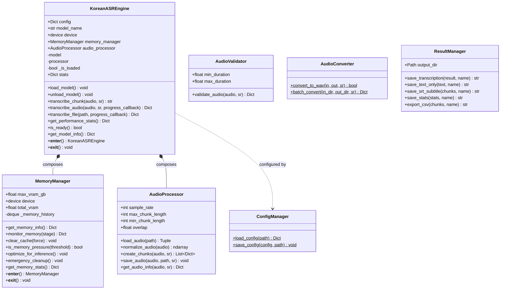
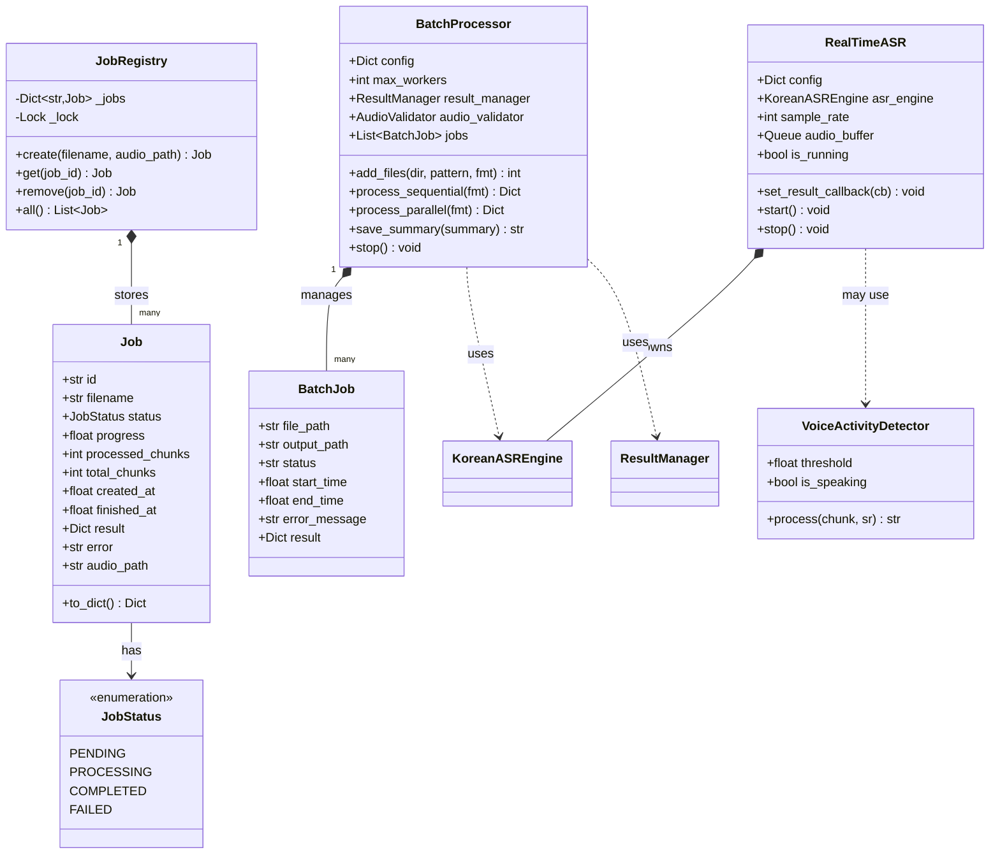
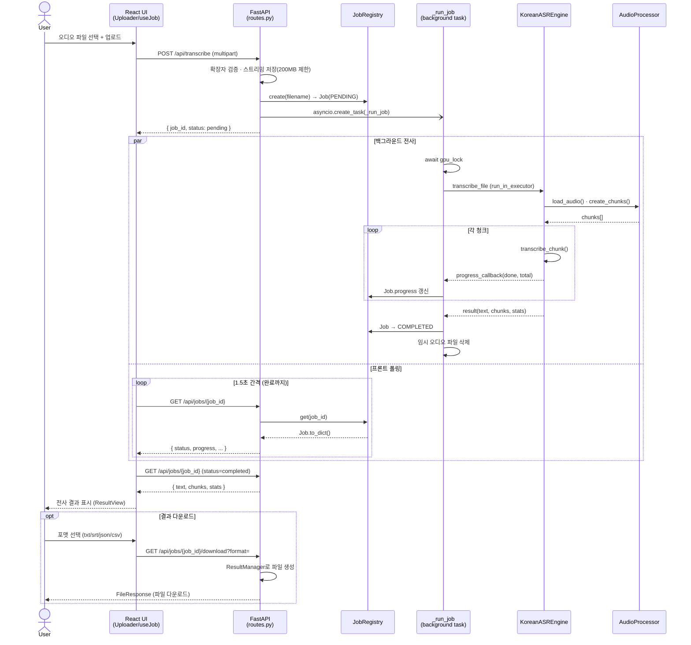
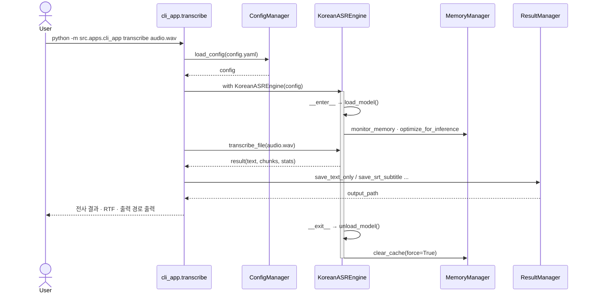
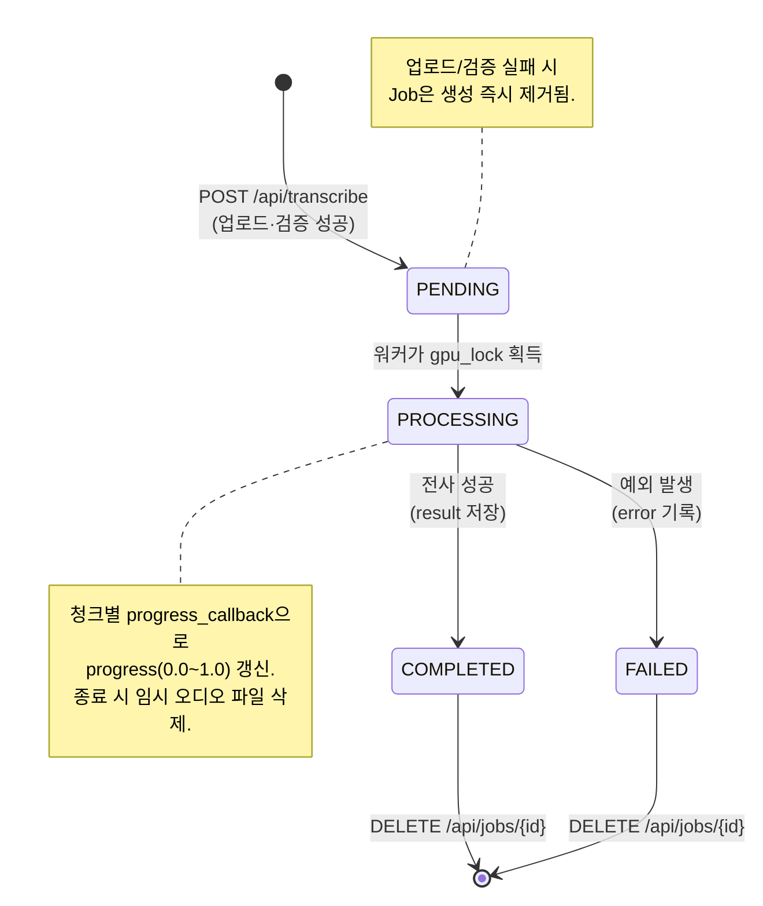
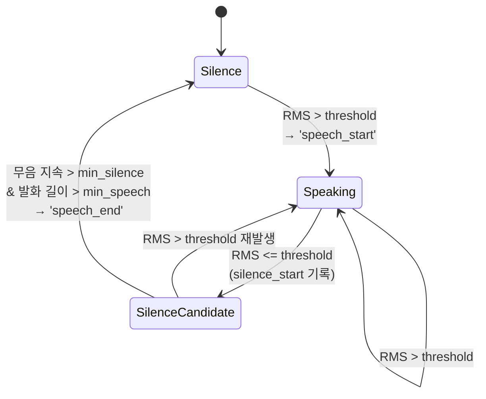
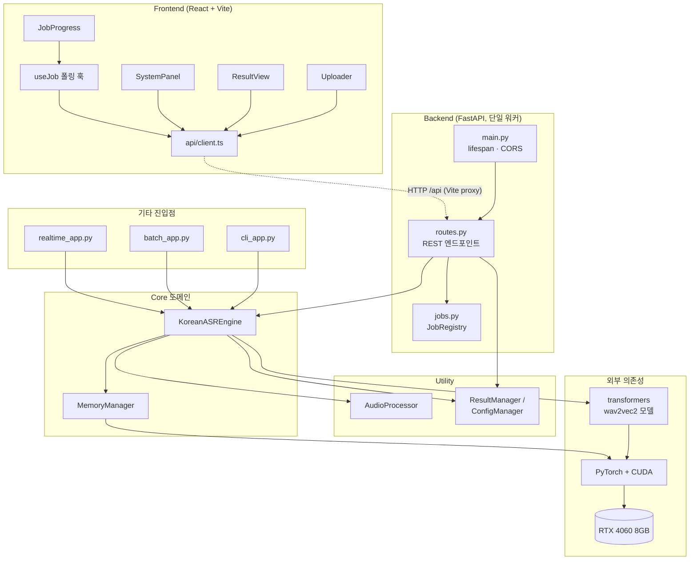
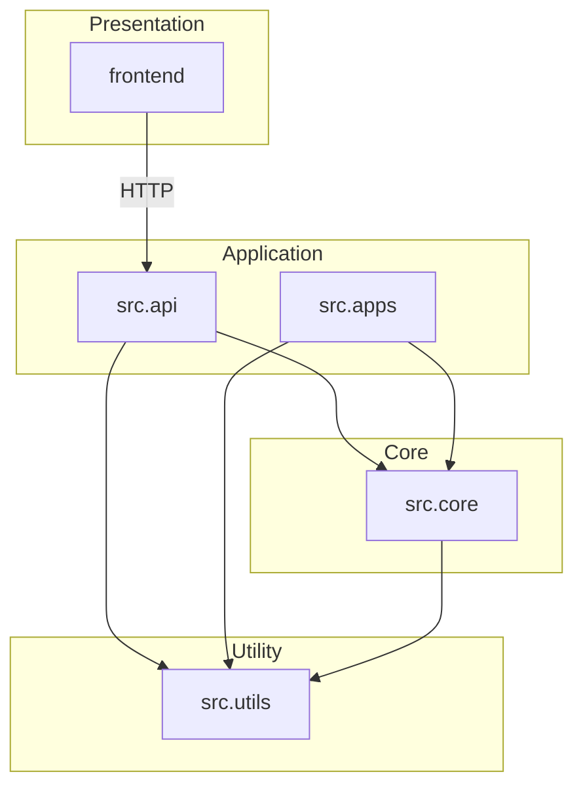

# UML 다이어그램

> Korean ASR for RTX 4060 — 클래스/시퀀스/상태/컴포넌트 다이어그램.
> 모든 다이어그램은 [Mermaid](https://mermaid.js.org/) 문법으로 작성되었으며,
> GitHub·VS Code(Markdown Preview Mermaid Support) 등에서 바로 렌더링된다.

## 1. 클래스 다이어그램 — Core & Utility

전사 핵심 도메인과 그것이 의존하는 유틸리티 클래스.

## 2. 클래스 다이어그램 — 애플리케이션 계층

API/배치/실시간 계층이 공통으로 `KoreanASREngine`을 재사용하는 구조.

## 3. 시퀀스 다이어그램 — 웹 파일 업로드 전사

브라우저에서 오디오를 업로드해 전사 결과를 받는 전체 흐름.

## 4. 시퀀스 다이어그램 — CLI 단일 파일 전사

## 5. 상태 다이어그램 — 전사 작업 (Job) 수명주기

웹 API의 `Job`이 거치는 상태 전이.

## 6. 상태 다이어그램 — 실시간 음성 활동 감지 (VAD)

`VoiceActivityDetector.process()`의 RMS 임계값 기반 상태 전이.

## 7. 컴포넌트 다이어그램 — 시스템 전체 구성

## 8. 패키지 의존성 다이어그램

레이어 간 의존 방향(위 → 아래). 순환 의존이 없음을 보여준다.

---

### 다이어그램 갱신 안내
코드 구조가 바뀌면 본 문서의 해당 다이어그램과
[`architecture.md`](./architecture.md)를 함께 갱신한다.
